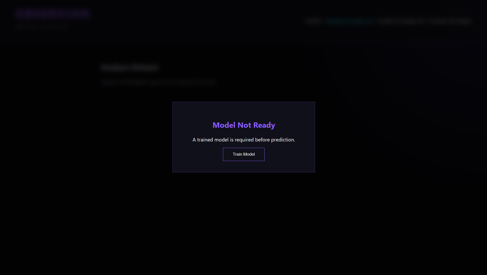
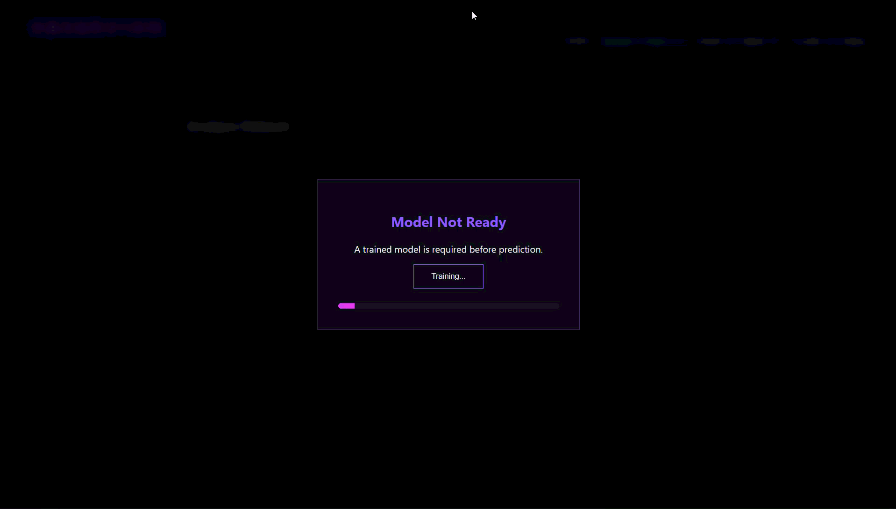
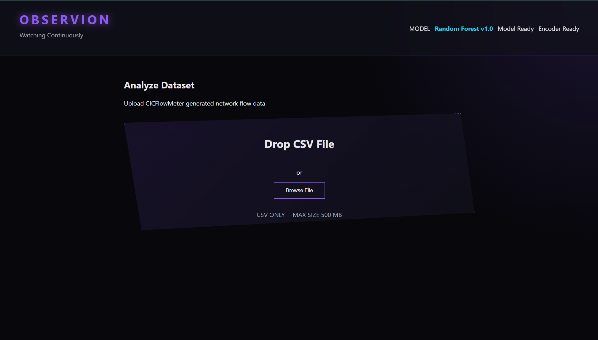
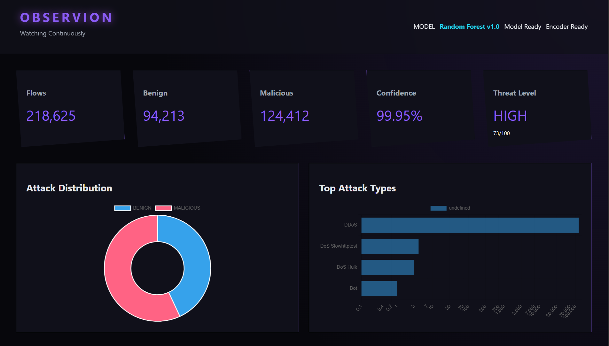
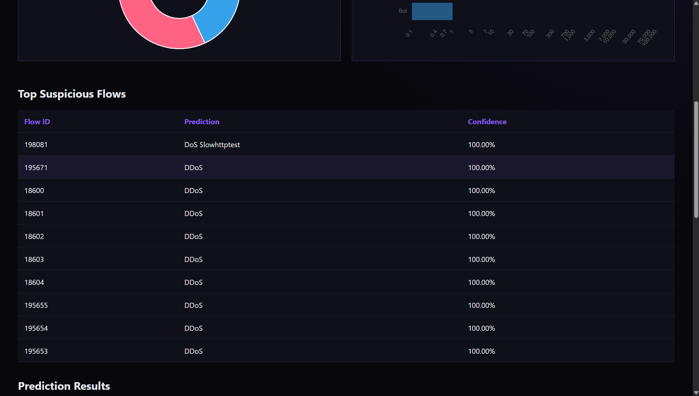
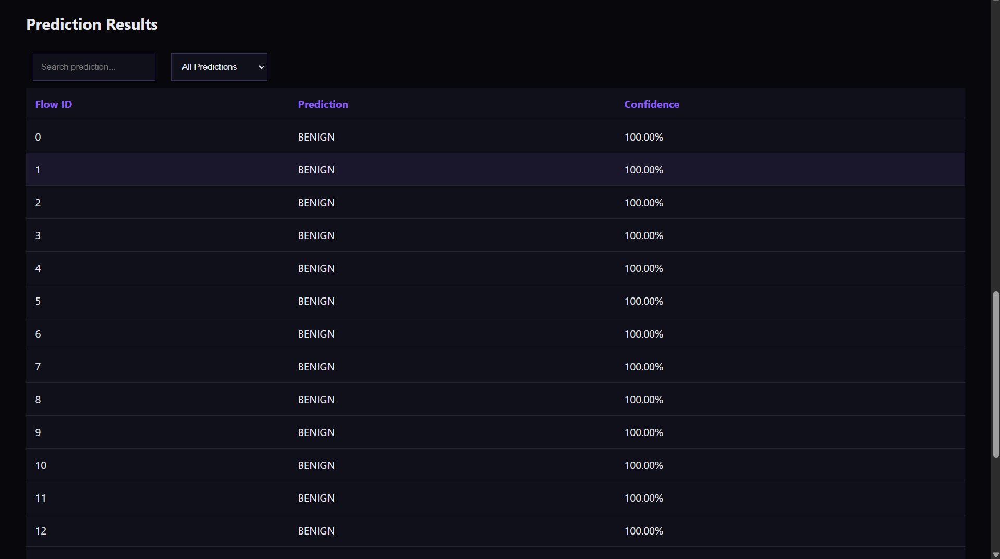

# Observion - Watching Continuously

This project was made in response to IBM PBEL 3.0's AI Batch 2's project topic: _AI-Based Cyber Threat Detection Framework_

---

## Table of contents

- [Overview](#overview)
- [Getting Started](#getting-started)
- [Repository structure](#repository-structure)
- [Features](#features)
- [Current Limitations](#current-limitation)
- [Planned](#planned)
- [Dataset](#dataset)
- [Contribution Policy](#contribution-policy)

---

## Overview

Observion is an AI-powered cyber threat detection and network observability platform designed to identify malicious network activity through machine learning.

---

## Getting Started

### Clone this repository

```bash
git clone https://github.com/CoderHarshDew/Harsh_Dewangan_PBEL_3.0.git
```

### Download Dataset

1. Go to [dataset website.](https://www.kaggle.com/datasets/chethuhn/network-intrusion-dataset)
2. Download the dataset.
3. Place the dataset files in your desired directory.

### Download prerequisites

```bash
pip install -r requirements.txt
```

### Launch Observion

From the root folder of the repository, run the following command:

```bash
python app.py 
```

### Training Model

The first time you launch Observion, the model would not exist, and you'd be asked to train it, the same happens if either model or encoder does not exist.







### Upload File

When model and encoder both exist on every launch you will see the upload file interface:




### See Prediction Result







---

## Repository Structure

```text
Observion/
├── config/
│   ├── ml/
│   └── validation/
├── docs/
├── frontend/
├── images/
├── notebooks/
├── src/
│   ├── backend/
│   ├── core/
│   ├── dataset/
│   ├── ml/
│   └── preprocessing/
├── .gitignore
├── app.py
├── LICENSE
├── readme.md
└── requirements.txt
```

---

## Features


* Thread score and confidence score.
* Almost perfect accuracy on 10 labels.
* Dashboard with informative visualization.
* YAML based configuration.
* Highly modular code that should support future development.
* Can process all acceptable files of a directory.
* Thorough preprocessing.

---

## Current limitation

Some of these are intentional:

* Only supports CSV files.
* Random Forest is the only model right now.
* Prediction of 5 classes is relevantly weak.
  * Some of these are due to high class imbalance in the original dataset.
  * Some are due to high semantic similarity between classes.

---

## Planned

ContainerLab integration is part of the long-term roadmap and is not yet implemented. Current model development, feature engineering, and evaluation are performed using the CICIDS2017 dataset. Future releases aim to introduce automated network simulation, telemetry collection, and synthetic dataset generation through ContainerLab.

---

## Dataset

This project uses the [CICIDS2017](https://www.kaggle.com/datasets/chethuhn/network-intrusion-dataset) dataset.

---


## Contribution Policy

Thank you for your interest in Observion.

This repository is intentionally maintained as a solo development project.
External code contributions and pull requests are not being accepted.

Feel free to:
- Explore the code
- Clone the repository
- Open issues for questions or discussion

Development decisions and implementation remain solely under the author's direction.
